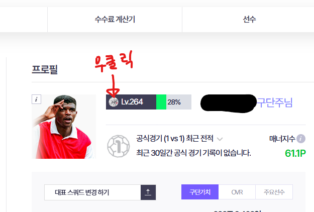
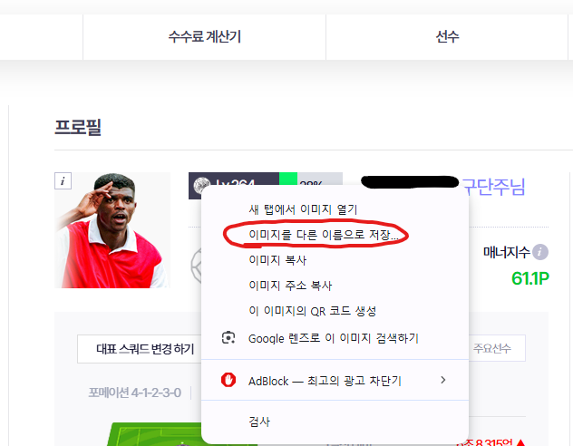
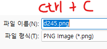
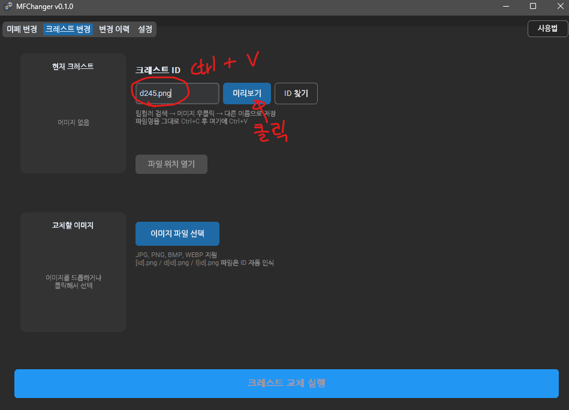
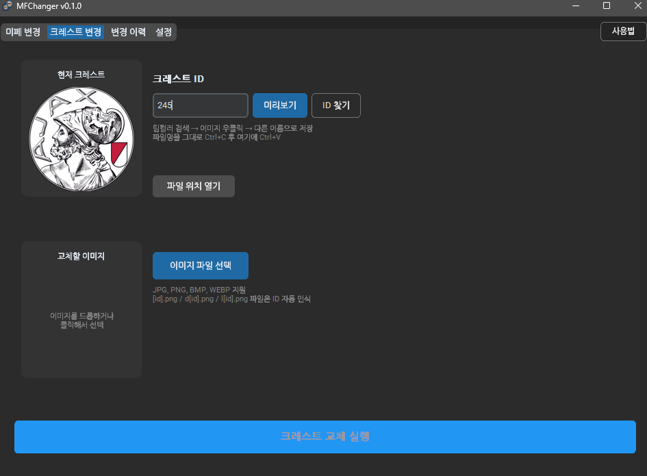

# MFChanger

FC온라인 선수 미페(미니 페이스) 및 팀 크레스트를 쉽게 교체할 수 있는 프로그램입니다.

---

## 주요 기능

- **선수 미페 교체** — 원하는 선수를 검색해 이미지를 교체
- **공식 미페로 복원** — CDN에서 공식 이미지를 다운로드해 원상복구
- **팀 크레스트 교체** — ID를 입력해 팀 엠블럼 이미지를 교체
- **변경 이력 및 복원** — 교체 전 원본을 자동 백업, 언제든지 되돌리기 가능
- **자동 업데이트** — 새 버전 출시 시 프로그램 내에서 바로 업데이트

---

## 사용 방법

### 선수 미페 교체

1. **미페 변경** 탭으로 이동합니다.
2. 검색창에 선수 이름을 입력하고 **검색** 버튼을 누릅니다.
   - 필터 버튼으로 시즌(TOTY, TOTS, UCL 등)을 좁혀서 찾을 수 있습니다.
3. 목록에서 원하는 선수를 클릭하면 오른쪽에 현재 적용 중인 미페가 표시됩니다.
   - 검색 목록의 썸네일도 현재 로컬에 적용된 이미지를 기준으로 보여주므로, 이미 바꾼 미페를 한눈에 파악할 수 있습니다.
   - 미페 교체 후 목록 썸네일도 즉시 갱신됩니다.
   - **현재 미페 / 공식 미페** 토글로 현재 적용 상태와 서버 원본을 비교할 수 있습니다. 공식 미페는 인터넷 연결이 필요합니다.
4. **이미지 파일 선택** 버튼으로 교체할 이미지를 고르거나, 이미지를 드래그 앤 드롭합니다.
   - JPG, PNG, BMP, WEBP를 지원합니다.
   - 비정방형 이미지는 자동으로 중앙 크롭되어 적용됩니다.
   - 파일명이 `p1231234.png`처럼 `p{SPID}` 형식이면 해당 PID를 가진 선수들이 자동으로 검색되고, SPID가 일치하는 카드가 자동 선택됩니다.
5. **미페 교체 실행** 버튼을 클릭하면 즉시 적용됩니다.

> **파일 위치 열기** 버튼을 누르면 해당 선수 이미지가 저장된 게임 폴더를 탐색기에서 바로 열 수 있습니다.

---

### 공식 미페로 복원

프로그램 사용 이전에 이미 미페를 바꿔둔 경우 등, 백업 없이도 공식 이미지로 되돌릴 수 있습니다.

1. **미페 변경** 탭에서 복원할 선수를 선택합니다.
2. **공식 미페로 복원** 버튼을 클릭합니다.
3. CDN에서 공식 미페를 다운로드해 로컬 파일을 덮어씁니다.
   - 백업 설정이 켜져 있으면 기존 파일이 자동 백업되므로, 이후 변경 이력에서 다시 되돌릴 수 있습니다.
   - 인터넷 연결이 필요합니다.

---

### 팀 크레스트 교체

1. **크레스트 변경** 탭으로 이동합니다.
2. **ID 찾기** 버튼을 눌러 FC온라인 팀컬러 검색 페이지에서 교체할 팀의 크레스트 ID를 확인합니다. (확인 방법은 아래 참고)
3. 확인한 ID를 입력란에 입력하고 **미리보기** 버튼을 누르면 현재 적용된 크레스트를 확인할 수 있습니다.
4. **이미지 파일 선택** 버튼으로 교체할 이미지를 고르거나 드래그 앤 드롭합니다.
   - `[id].png`, `d[id].png`, `l[id].png` 형식의 파일명이면 ID가 자동으로 입력됩니다.
     예) `1234.png` / `d1234.png` / `l1234.png`
   - 입력란에 `d1234`, `l1234.png` 형식으로 직접 붙여넣어도 숫자 ID만 자동으로 인식합니다.
   - 권장 이미지 크기는 **256 × 256 픽셀 정방형**입니다. 비정방형 이미지는 자동으로 중앙 크롭됩니다.
5. **크레스트 교체 실행** 버튼을 클릭합니다.

#### 크레스트 ID 확인 방법

**팀컬러가 있는 경우**

**Step 1.** **ID 찾기** 버튼을 눌러 FC온라인 팀컬러 검색 페이지로 이동합니다.

**Step 2.** 원하는 팀을 검색하면 팀 엠블럼 이미지가 표시됩니다.

**Step 3.** 이미지를 **우클릭 → 다른 이름으로 저장**하면 파일명에서 ID를 확인할 수 있습니다. 파일명을 그대로 복사해 입력란에 붙여넣으면 자동으로 인식됩니다. `.png` 확장자가 포함된 상태로 붙여넣어도 됩니다.

---

**팀컬러가 없는 경우**

팀컬러 검색으로 찾을 수 없는 팀의 경우 아래 방법으로 ID를 확인합니다.

**Step 1.** 인게임에서 원하는 크레스트를 팀에 직접 설정합니다.

**Step 2.** FC온라인 홈페이지에 변경 사항이 반영될 때까지 잠시 기다립니다. 이후 홈페이지 내 자신의 프로필에 표시되는 크레스트 아이콘을 찾습니다.

**Step 3.** 크레스트 이미지를 우클릭합니다.

**Step 4.** **다른 이름으로 저장**을 클릭합니다.

**Step 5.** 저장 대화상자에서 파일명을 따로 수정하지 말고 바로 **Ctrl+C**로 복사합니다.

**Step 6.** MFChanger의 크레스트 ID 입력란에 **Ctrl+V**로 붙여넣습니다.

**Step 7.** **미리보기** 버튼을 클릭해 크레스트를 확인합니다.

---

### 변경 이력 및 복원

**변경 이력** 탭에서 지금까지 교체한 미페와 크레스트 목록을 확인할 수 있습니다.

- 각 항목에는 **원본 → 변경 후** 이미지가 나란히 표시됩니다.
- **복원** 버튼을 누르면 백업된 원본 파일로 되돌립니다.
  - 백업이 없는 경우 교체 파일을 삭제하며, 게임 재실행 시 자동으로 원본으로 복구됩니다.
- **폴더** 버튼으로 해당 항목의 백업 폴더를 탐색기에서 열 수 있습니다.
- **전체 복원** 버튼으로 해당 섹션의 모든 변경 사항을 한 번에 되돌릴 수 있습니다.
- 이력에서 복원해도 검색 목록 썸네일이 즉시 갱신됩니다.

---

### 설정

**설정** 탭에서 다음 항목을 관리합니다.

| 항목 | 설명 |
|------|------|
| FC온라인 설치 경로 | 게임이 설치된 폴더 경로. 기본값은 `C:\Nexon\EA SPORTS(TM) FC ONLINE` |
| 백업 설정 | 교체 전 원본 파일을 자동 백업할지 여부와 저장 위치 |
| 폰트 크기 | UI 텍스트 크기를 작게 / 보통 / 크게 / 매우 크게 중에서 선택. 즉시 적용됩니다. |
| 선수 데이터 동기화 | 선수 목록과 시즌 정보를 최신 버전으로 업데이트 |
| 업데이트 | 시작 시 자동 업데이트 확인 여부 및 수동 확인 |

---

## 주의사항

- 변경 사항은 **게임 실행 중에도 실시간으로 적용**됩니다. 교체 후 다른 화면으로 이동했다가 돌아오면 바로 반영됩니다.
- FC온라인 업데이트 후 게임이 캐시를 초기화하면 교체한 이미지가 원래대로 돌아갈 수 있습니다.
- 백업 기능을 활성화해두면 언제든지 원본으로 복원할 수 있으므로 사용을 권장합니다.

### 오프라인 환경 제한

인터넷 연결 없이도 기본 기능은 사용할 수 있지만, 일부 기능은 동작하지 않습니다.

| 기능 | 오프라인 |
|------|----------|
| 미페 교체 / 크레스트 교체 | 정상 동작 |
| 현재 미페 프리뷰 | 정상 동작 |
| 복원 / 변경 이력 | 정상 동작 |
| 검색 목록 썸네일 | 정상 동작 (로컬 파일 기준) |
| 공식 미페 프리뷰 | 표시 안 됨 |
| 공식 미페로 복원 | 불가 |
| 선수 데이터 동기화 | 불가 |
| 자동 업데이트 확인 | 불가 |
| 첫 실행 시 선수 목록 로딩 | `.cache` 폴더 동봉 시 정상, 없으면 불가 |

---

## 다운로드

[v0.1.0 다운로드](https://github.com/HazySound/MFChanger/releases/tag/v0.1.0)에서 초기 버전을 받을 수 있습니다. 이후 업데이트는 프로그램 실행 시 자동으로 확인되며, 프로그램 내에서 바로 설치할 수 있습니다.
